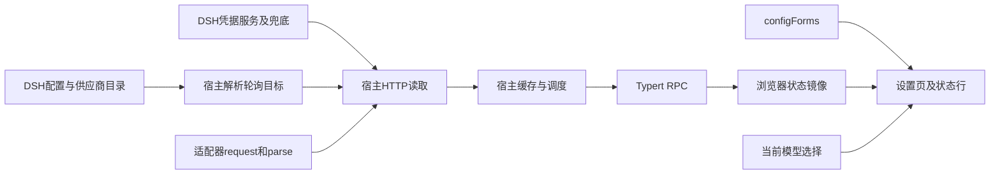

# 架构与验证

本文件描述当前代码如何装配及验证能覆盖什么。设计约定见 [设计共识](design-consensus.md)，领域语言见 [术语表](../CONTEXT.md)，未完成事项见 [Backlog](backlog.md)。2026-10-08审计基线为3ad9a71；当时281条测试通过，仍发现装配、金额与展示缺陷，详见 [审计快照](research/repository-audit-2026-10-08.md)。

## 数据流

数值、source元数据和origin-only endpointHints从宿主经RPC传到浏览器；设置页和状态行用该提示调用共享resolveProvider。提示不含userinfo/query或apiKey，[A08](backlog.md#a08) 的两端识别缺口已随0.4.5发布。SVG只在浏览器绘制，不是两端传输协议。本文的当前实现指工作树及已发布npm0.4.5；npm0.4.4仍是整改前版本。

宿主产物是ESM，客户端是平台模块加载器接收的CJS工厂；三个预构建文件提交入库，供DSH直接GitHub安装。浏览器仅依赖shell模块表提供的运行模块；宿主运行依赖zod和共享schemastery。具体依赖与link解析必须按宿主版本验证。

## 代码地图

### 宿主

| 文件 | 当前职责 |
|---|---|
| [入口](../src/index.ts) | 装配配置、provider事实、凭据、读取、调度和RPC服务；监听turn/end |
| [配置](../src/host/settings.ts) | volatile根Config、normalizeConfig、loader/volatile-update |
| [目标](../src/host/targets.ts) | normalize迁移后仅生成provider目标，携带endpoint/pin/ref；source+mode仍只选一个目标 |
| [provider信息](../src/host/provider-refs.ts) | 跨条目apiKeyEnv候选与端点提示；preferredRefs随有效目标参与签名 |
| [凭据](../src/host/credentials.ts) | 候选顺序、resolveApiKey、只含状态的describeCredentials |
| [凭据兜底](../src/host/credential-fallback.ts) | 平台无结果时直读env/所用home的凭据文件并标来源 |
| [目录](../src/host/catalog.ts) | 将Adapter元数据转为JSON SourceCatalog |
| [HTTP读取](../src/host/read.ts) | 15s单次超时、镜像顺序，JSON语法错归parse、body中断归network |
| [缓存调度](../src/host/refresh.ts) | 私有摘要/generation/签名隔离身份，在途去重、旧值/脱敏错误、live idle与stop收尾 |
| [RPC服务](../src/host/service.ts) | 普通getState仅初始化缺失/变更身份并读镜像；force主动刷新，输出origin-only提示及凭据状态 |
| [RPC清单](../src/host/typert.ts) | named TYPERT、zod v4 codec、参数/结果验证 |
| [适配器类型](../src/host/sources/types.ts) / [工具](../src/host/sources/normalize.ts) | RequestInput、UsageSource、SourceError、数值/时间/地址归一化 |
| [注册](../src/host/sources/index.ts) / [模板](../src/host/sources/_template.ts) | ALL_SOURCES、findSource、新源骨架 |
| [DeepSeek](../src/host/sources/deepseek.ts) / [z.ai](../src/host/sources/zai.ts) / [Kimi](../src/host/sources/kimi.ts) / [OpenCode](../src/host/sources/opencode.ts) / [Sub2API](../src/host/sources/sub2api.ts) | 各源request与parse，字段语义见适配器指南 |

### 浏览器

| 文件 | 当前职责 |
|---|---|
| [入口](../src/client/index.tsx) | 词典、configForms、RPC贡献、30s轮询及事件、两个页面挂点 |
| [contribution](../src/client/contribution.ts) / [remote读取](../src/client/remote.ts) | 客户端codec工厂；ctx.get读取自己贡献的命名空间 |
| [store](../src/client/store.ts) | 数值/凭据/模型目录镜像、在途去重和独立错误通道 |
| [状态切片](../src/client/status-source.ts) | UI只消费所需store Interface |
| [设置适配](../src/client/settings-form.ts) | form快照归一化、按引用缓存、写操作转发 |
| [设置页](../src/client/SettingsSection.tsx) | provider模式/顺序/高级字段、凭据写入、显示选项 |
| [provider行](../src/client/provider-rows.ts) / [模型行](../src/client/model-rows.ts) | 分组、存在性、模式、排序的纯逻辑 |
| [状态行](../src/client/StatusLine.tsx) / [文字](../src/client/status-text.ts) | 当前模型解析、显示段、SVG环、tooltip、折行 |
| [槽位](../src/client/slots.ts) | 唯一conversation.input.dock，id=usage-state、order=200 |
| [词典](../src/client/locales.ts) | 中英键集、命名空间和窗口文案 |
| [结构类型](../src/client/context.ts) / [hooks](../src/client/hooks.ts) | 平台形状镜像、订阅和倒计时时钟 |

### 共享与构建

| 文件 | 当前职责 |
|---|---|
| [types](../src/shared/types.ts) | 余额、窗口、读数和快照类型 |
| [config](../src/shared/config.ts) | 默认值、宽松归一化、legacy迁移、source识别hints |
| [providers](../src/shared/providers.ts) | provider解析、origin提取、有效顺序 |
| [display](../src/shared/display.ts) | SourceCatalog类型、格式化、severity和显示段 |
| [rpc](../src/shared/rpc.ts) | 两端线上类型由host/service复用，含可选origin-only endpointHints |
| [构建](../tsdown.config.ts) | 宿主index/Typert ESM、客户端单文件工厂；watch包含全部入口 |
| [清单](../package.json) / [patch](../cordis.patch.yml) | exports/files/engines、client inject、usage-state条目与config:{} |

## 重要Interface与约束

- **Adapter**：request纯构造，parse纯解析，FetchLike负责网络；已有五源，变化在该Seam集中。金额按字段契约，不按数值猜单位；非法读数不造0。浏览器不import宿主Adapter。
- **UsageStateStore**：时钟、live policy、targets、凭据和read可注入。目标签名含endpoint/pin/ref/preferredRefs，私有SHA-256含本次有效凭据，generation隔离配置代次；摘要不进RPC。ABA/晚lookup/晚HTTP不能写回旧值，stop使后续refresh不再查网络，ctx.effect清理调度。
- **目标解析**：共享resolveProvider集中provider→legacy→声明origin优先级；目标供请求与描述共用。旧models仅normalize迁移；权威空LLM目录与未知目录分别处理。仍是一source+mode一目标，不是多账户注册表。
- **RPC**：getState(false)用onlyIfMissing初始化缺失/变更身份，其他普通poll读取镜像；周期/回合由宿主负责。结果带source目录、快照、origin-only endpointHints；host/shared复用线上类型。
- **客户端镜像**：配置/凭据变更invalidate读数并增加generation，旧RPC不能复原旧身份。显式force遇普通在途RPC排一次后续，已有force则共享。源/RPC失败保留同身份数字且显示年龄/原因。
- **配置写入**：ConfigForm是Promise<boolean>，false按拒绝反馈；凭据保存/清除有busy/pending、错误和独立writable控制。未编辑输入框失焦不提交陈旧草稿。React交互测试覆盖回调和effect，但不替代浏览器视觉/真实凭据服务。

## 测试与证据

| 验证层 | 入口 | 当前范围与限制 |
|---|---|---|
| 纯字段/来源 | [providers](../tests/shared/providers.test.ts)、[Kimi](../tests/sources/kimi.test.ts)、[DeepSeek](../tests/sources/deepseek.test.ts) | 官方元单位、真实0/畸形字段及legacy/provider优先级；未调用真实账户 |
| 宿主装配 | [entry](../tests/host/entry.test.ts) | fake ctx/fetch下的ref/pin、轮换、ABA、晚lookup/HTTP、目标移除、错误密钥回显脱敏 |
| 调度 | [refresh](../tests/host/refresh.test.ts)、[service](../tests/host/service.test.ts) | 30s普通poll不改变idle、live重调、force、回合及stop序列 |
| 客户端 | [store](../tests/client/store.test.ts)、[render](../tests/client/render.test.ts)、[interactions](../tests/client/interactions.test.ts) | 身份失效与force排序、两UI提示/失败显示、真实React回调/效果；不是浏览器布局或真实平台写入 |
| 平台契约 | [host Typert](../tests/host/typert.test.ts)、[client contribution](../tests/client/contribution.test.ts) | 使用当前真实validator/registry；不替代完整DSH安装 |
| 构建与包 | [bundle](../tests/build/bundle.test.ts)、[artifacts](../scripts/verify-artifacts.mjs)、[package](../scripts/verify-package.mjs) | 缺文件硬失败；HEAD一致性及真实tarball白名单/入口/patch/离线链接；提交前产物漂移合理失败 |
| Node运行边界 | [runtime smoke](../scripts/runtime-smoke.mjs) | 预构建JS/fake host；可独立安装tarball和真实schema指定版本，不注入volatile polyfill |

本轮实现提交为 [984878e](https://github.com/takboo/dsh-usage-state/commit/984878ee0ddc8ce3e42bcbc69d7a5052c6cdcf10)。Node26.10.0、开发下界22.18.0与规范24.21.0完整319回归均通过，无失败或跳过；规范Node24产物已提交，HEAD三bundle一致性、元数据及工作流解析/权限依赖校验通过。2026-10-08原审计281测试/10文件打包是历史基线，不是本轮运行证据。

### 本轮本地验收（2026-10-08）

| 检查 | 实际结果 |
|---|---|
| 完整回归 | Node26.10.0、22.18.0、24.21.0均319通过、0失败、0跳过 |
| 提交与产物 | 实现984878e；三预构建文件对HEAD一致；缺入口检查硬失败 |
| 工作流 | 4份YAML真实解析、32组shell语法、16处完整SHA；稳定发布依赖Node20，默认verify；npm/GitHub分权 |
| 发布标签保护 | 临时克隆中验证合法稳定标签及拒绝重复已发布npm版本；真实仓库未创建标签 |
| 最终包 | 文档提交6880bd411f8efa264edb1aa02267047602503585的干净检出产生10文件tarball；入口、patch、6个包内相对链接及报告/checksum复验通过 |
| 运行边界 | 同一个tarball在Node20.20.2隔离安装真实schema3.18.4和声明下界3.18.3，各自宿主/RPC codec/fake fetch通过，无polyfill |

包名为dsh-usage-state-0.4.4.tgz，本地未发布产物与registry已发布0.4.4不同。上述同一包的SHA-256为 `7c738d8fc6659abbd1182a022e548c28d27e32a1680209224a8aaa5ff31a459c`，报告workingTreeDirty=false。验收补充只修改未随包的架构/待办文档，不重新打包或改写这份已验证字节。

这些都是本地验证：没有GitHub Actions云端执行、npm/GitHub发布、真实DSH profile安装、真实凭据写入或厂商账户/视觉验收。Node20加载/模拟RPC通过不等同于所有受支持DSH发行版均真机验证。

历史真机证据（2026-10-05、DSH0.2.0-rc.2）覆盖DeepSeek、z.ai、OpenCode正常读数、设置页及槽位位置，来自修订17–23和截图。历史真实key直连是在线查询。Kimi Code/Sub2API真实账户、高阈值视觉、真实手写key生效和OpenCode非零仍未闭环。

规范工具链固定Node24.21.0/npm11.19.1；schema下界为3.18.3、锁3.18.4。运行Node≥20与DSH0.2声明未因开发工具扩张。结构类型镜像仍需平台/安装验证。

### 首次OIDC发布验收（2026-10-10）

| 检查 | 实际结果 |
|---|---|
| 发布引用 | v0.4.5指向 [353bb2a](https://github.com/takboo/dsh-usage-state/commit/353bb2af09ea983444f2edfe7856a9893476b8d3)，package/lock及带日期Changelog一致 |
| main CI | [四项检查通过](https://github.com/takboo/dsh-usage-state/actions/runs/38028317296)：工作流语法、Node22.18开发回归、规范Node24打包及Node20预构建冒烟 |
| 自动发布 | [tag派发成功](https://github.com/takboo/dsh-usage-state/actions/runs/38028386351)，随后 [main Release](https://github.com/takboo/dsh-usage-state/actions/runs/38028392663)通过319测试、同包Node20冒烟、npm OIDC发布及GitHub附件上传 |
| npm | [registry元数据](https://registry.npmjs.org/dsh-usage-state)记录0.4.5发布于2026-10-10T05:44:19.690Z，latest为0.4.5，包含provenance attestation |
| 最终字节 | 本地干净发布检出的10文件tarball、npm下载包与 [GitHub Release附件](https://github.com/takboo/dsh-usage-state/releases/tag/v0.4.5)完全一致；8个包内相对链接验证通过 |

已发布包SHA-256为 `56e008a2767c6bef3a201a8483e1c4ff8b874e3a3223fe86e477535b9dc19139`。发布后文档更新不移动v0.4.5，也不重新发布已占用版本。上述云端和字节验收补充了2026-10-08本地证据；真实DSH profile安装、凭据写入、厂商账户和视觉验收范围不变。

具体命令见 [开发指南](development.md)，发布与tarball见 [发布流程](release.md)。CI、Dependabot和Release已在GitHub；稳定版本tag自动派发main上的Release，npm publisher/OIDC已实跑成功。main保护仍待配置；实际发布状态见 [Backlog](backlog.md)。
