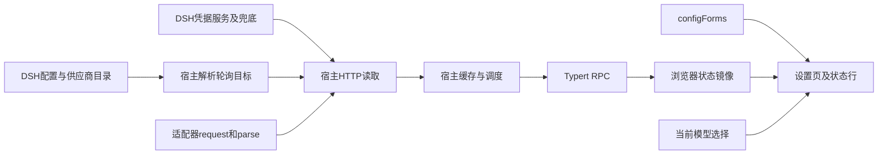

# 架构与验证

本文件描述当前代码如何装配及验证能覆盖什么。设计约定见 [设计共识](design-consensus.md)，领域语言见 [术语表](../CONTEXT.md)，未完成事项见 [Backlog](backlog.md)。2026-10-08审计基线为3ad9a71；当时281条测试通过，仍发现装配、金额与展示缺陷，详见 [审计快照](research/repository-audit-2026-10-08.md)。

## 数据流

数值和source元数据从宿主经RPC传到浏览器。浏览器另外读取模型目录和配置，并自行resolveProvider；当前RPC未传provider端点/有效目标映射，导致 [A08](backlog.md#a08)。SVG只在浏览器绘制，不是两端传输协议。

宿主产物是ESM，客户端是平台模块加载器接收的CJS工厂；三个预构建文件提交入库，供DSH直接GitHub安装。浏览器仅依赖shell模块表提供的运行模块；宿主运行依赖zod和共享schemastery。具体依赖与link解析必须按宿主版本验证。

## 代码地图

### 宿主

| 文件 | 当前职责 |
|---|---|
| [入口](../src/index.ts) | 装配配置、provider事实、凭据、读取、调度和RPC服务；监听turn/end |
| [配置](../src/host/settings.ts) | volatile根Config、normalizeConfig、loader/volatile-update |
| [目标](../src/host/targets.ts) | source+mode去重，先legacy models再provider目标，携带endpoint/pin |
| [provider信息](../src/host/provider-refs.ts) | 从跨条目配置取apiKeyEnv和端点提示 |
| [凭据](../src/host/credentials.ts) | 候选顺序、resolveApiKey、只含状态的describeCredentials |
| [凭据兜底](../src/host/credential-fallback.ts) | 平台无结果时直读env/所用home的凭据文件并标来源 |
| [目录](../src/host/catalog.ts) | 将Adapter元数据转为JSON SourceCatalog |
| [HTTP读取](../src/host/read.ts) | 请求/镜像顺序、15s单次超时、失败分类、调用parse |
| [缓存调度](../src/host/refresh.ts) | 成功最小间隔、在途去重、旧值陈旧标记、回合延迟和idle timer |
| [RPC服务](../src/host/service.ts) | getState触发所有目标刷新后取快照；describeCredentials按目标输出状态 |
| [RPC清单](../src/host/typert.ts) | named TYPERT、zod v4 codec、参数/结果验证 |
| [适配器类型](../src/host/sources/types.ts) / [工具](../src/host/sources/normalize.ts) | RequestInput、UsageSource、SourceError、数值/时间/地址归一化 |
| [注册](../src/host/sources/index.ts) / [模板](../src/host/sources/_template.ts) | ALL_SOURCES、findSource、新源骨架 |
| [DeepSeek](../src/host/sources/deepseek.ts) / [z.ai](../src/host/sources/zai.ts) / [Kimi](../src/host/sources/kimi.ts) / [OpenCode](../src/host/sources/opencode.ts) / [Sub2API](../src/host/sources/sub2api.ts) | 各源request与parse，字段语义见适配器指南 |

### 浏览器

| 文件 | 当前职责 |
|---|---|
| [入口](../src/client/index.tsx) | 词典、configForms、RPC贡献、30s轮询及事件、两个页面挂点 |
| [contribution](../src/client/contribution.ts) / [remote读取](../src/client/remote.ts) | 客户端codec工厂；ctx.get读取自己贡献的命名空间 |
| [store](../src/client/store.ts) | 数值/凭据/模型目录镜像、在途去重和独立错误通道 |
| [状态切片](../src/client/status-source.ts) | UI只消费所需store Interface |
| [设置适配](../src/client/settings-form.ts) | form快照归一化、按引用缓存、写操作转发 |
| [设置页](../src/client/SettingsSection.tsx) | provider模式/顺序/高级字段、凭据写入、显示选项 |
| [provider行](../src/client/provider-rows.ts) / [模型行](../src/client/model-rows.ts) | 分组、存在性、模式、排序的纯逻辑 |
| [状态行](../src/client/StatusLine.tsx) / [文字](../src/client/status-text.ts) | 当前模型解析、显示段、SVG环、tooltip、折行 |
| [槽位](../src/client/slots.ts) | 唯一conversation.input.dock，id=usage-state、order=200 |
| [词典](../src/client/locales.ts) | 中英键集、命名空间和窗口文案 |
| [结构类型](../src/client/context.ts) / [hooks](../src/client/hooks.ts) | 平台形状镜像、订阅和倒计时时钟 |

### 共享与构建

| 文件 | 当前职责 |
|---|---|
| [types](../src/shared/types.ts) | 余额、窗口、读数和快照类型 |
| [config](../src/shared/config.ts) | 默认值、宽松归一化、legacy迁移、source识别hints |
| [providers](../src/shared/providers.ts) | provider解析、origin提取、有效顺序 |
| [display](../src/shared/display.ts) | SourceCatalog类型、格式化、severity和显示段 |
| [rpc](../src/shared/rpc.ts) | 两端线上类型；与host/service仍有重复定义 |
| [构建](../tsdown.config.ts) | 宿主index/Typert ESM、客户端单文件工厂；watch包含全部入口 |
| [清单](../package.json) / [patch](../cordis.patch.yml) | exports/files/engines、client inject、usage-state条目与config:{} |

## 重要Interface与已知缺口

- **Adapter**：request纯构造，parse纯解析，FetchLike负责网络；已有五源，变化在该Seam集中。不要让浏览器import宿主Adapter。
- **UsageStateStore**：时钟、policy、targets、凭据和read可注入，负责缓存/调度。当前身份只用source:mode，live policy不等于live timer，见A04/A06。
- **目标解析**：目前apiKeyRef在目标转抄时丢失，pin在入口丢失，legacy优先又绕过provider选择，见A01/A03/A05。未来修复应集中有效目标解析，避免加更多平行推断。
- **RPC**：getState不是纯快照getter，会真实查询；前端30s轮询改变有效请求频率。结果带source目录及快照，但不带provider映射。
- **客户端镜像**：保留旧数字不等于正确标陈旧；全局RPC错误仅部分渲染路径可见，见A10。
- **配置写入**：结构镜像和SSR测试没有验证实际异步mutate失败/只读行为，见A16。

## 测试与证据

| 验证层 | 已有入口 | 能证明的范围与限制 |
|---|---|---|
| 字段/业务纯函数 | [共享测试示例](../tests/shared/providers.test.ts)、[源测试示例](../tests/sources/kimi.test.ts) | 输入输出；当前部分金额测试固定错误语义，需要更新 |
| 宿主装配 | [entry测试](../tests/host/entry.test.ts) | fake ctx/fetch下的依赖接线；高级覆盖和配置代次仍缺用例 |
| 调度 | [refresh测试](../tests/host/refresh.test.ts) | 注入时钟下固定policy；没有证明配置更新会重调timer |
| 客户端逻辑/初始渲染 | [store测试](../tests/client/store.test.ts)、[render测试](../tests/client/render.test.ts) | SSR/桩件下初始输出；不覆盖真实点击、effect和所有视觉环境 |
| 真实平台契约 | [宿主Typert](../tests/host/typert.test.ts)、[客户端贡献](../tests/client/contribution.test.ts) | 当前依赖版本validator/registry接受manifest；不替代完整安装 |
| 已构建产物 | [bundle测试](../tests/build/bundle.test.ts)、[共享harness](../tests/support/browser-face.mjs) | 工厂/require/exports和fake宿主、真实registry；缺文件目前skip，且未强制源码一致 |
| 干净安装与打包 | 2026-10-08审计快照 | npm ci/typecheck/281 tests/build与10文件pack通过；无本轮新真机安装 |

历史真机证据（2026-10-05、DSH0.2.0-rc.2）覆盖DeepSeek、z.ai、OpenCode正常读数、设置页与槽位位置；来源为修订17–23及仓库截图。历史记录中真实key直连是在线查询，不称“离线复现”。高阈值视觉、Kimi Code/Sub2API真实账户、手写key生效与OpenCode非零路径尚未闭环。

Node20.20.2加载宿主产物通过，不等于所有功能在最低版本完整通过。类型镜像避免合并冲突，但不静态验证其与平台声明一致。未来验证记录应注明插件commit、DSH、Node、安装形态、所用产物和是否实际跑了账户请求。

具体开发命令见 [开发指南](development.md)，发布门禁和tarball冒烟见 [发布流程](release.md)。当前没有GitHub CI；文档中的检查要求不意味着自动化已完成。
